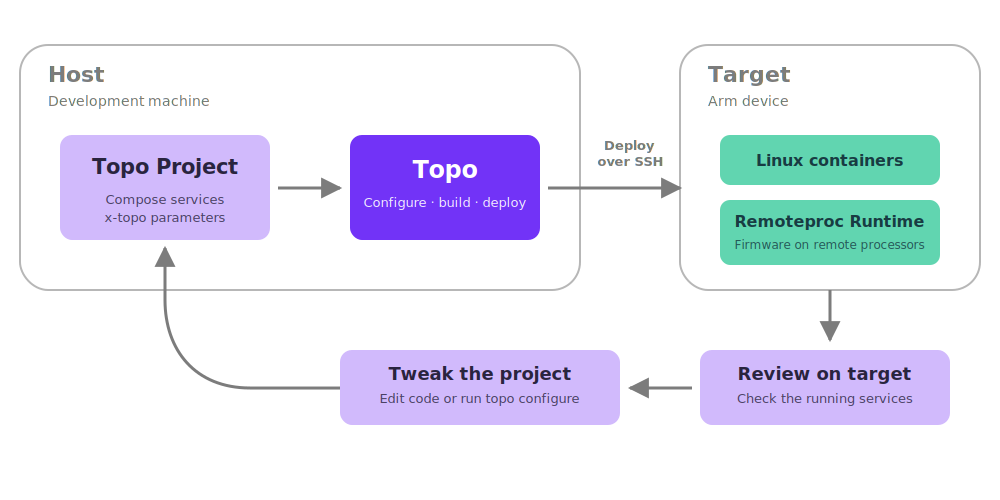

# What is Topo?

Topo helps you discover, configure, and deploy containerized software to Arm-based Linux devices over SSH. It uses Compose projects, container images, and standard container tools.

Topo provides a command-line interface (CLI). You can also use the [Topo extension for Visual Studio Code](https://github.com/arm/vscode-topo).

You run Topo on a host and deploy to a target. The host can run Linux, macOS, or Windows. The target must run Linux on AArch64 (`linux/arm64`). The same system can act as both the host and target.

This diagram shows where Topo runs, what it deploys, and how you iterate on a project.

## Benefits of Topo

Use Topo to:

- Evaluate an Arm device by finding projects that match its hardware capabilities
- Use an incremental build and deployment loop between your host and a remote device
- Orchestrate Linux services and remote processor firmware in one project on supported heterogeneous devices

Topo works with [Remoteproc Runtime](https://github.com/arm/remoteproc-runtime) to package and run firmware through container workflows.

## Projects

A Topo Project is a Compose project that includes `x-topo` metadata. The metadata describes the purpose, hardware requirements, and configurable parameters of the project. Topo uses this information to check target compatibility and configure the project for your use case.

The configured project remains a standard Compose project that you can inspect, modify, and use with existing container tools. You can also use Topo to deploy an existing Compose project whose Linux services target `linux/arm64`.

## Typical workflow

A typical Topo workflow has 4 steps:

1. Check the host, SSH connection, target software, and target hardware.
2. Discover projects and check their compatibility with the target.
3. Copy and configure a project on the host.
4. Build or pull images, transfer them to the target, and start the services.

Later deployments reuse cached image layers where possible. This reduces the work required after you change a project.

## Next steps

- [Install Topo](install.mdx) and follow [Getting started](getting-started.md) to deploy a web application to a target.
- Use the [Topo extension for Visual Studio Code](https://github.com/arm/vscode-topo) for editor integration.
- Review the [Topo Project Specification](../project-specification) to learn how Topo Projects are defined.
